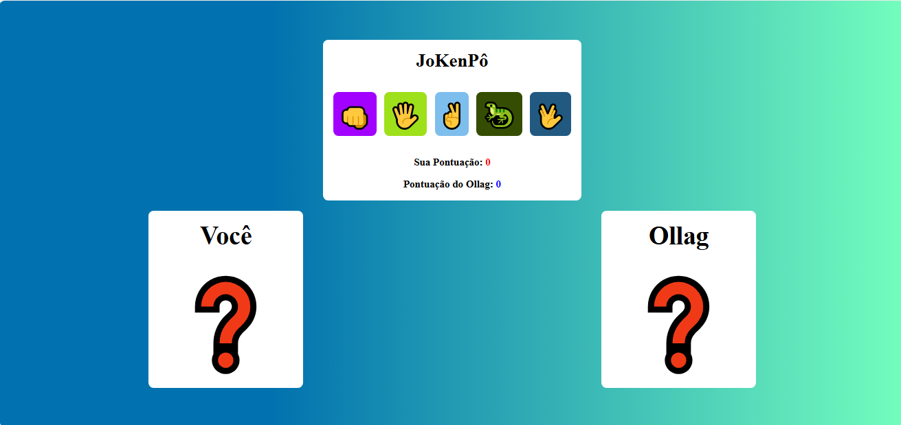

<h2 align="center">
joKenPô
</h2>
 
 
 

## - Projeto 💻

O Jogo JokenPo foi inspirada no seriado de televisão <i>The Big Bang Theory</i> e tem uma interface intuitiva para o usuário se divertir!.
  

## - Como Jogar: 🎮 

- O usuário escolhe as opções: pedra, papel, tesoura, lagardo ou spock clicando no botão.
- A lógica dinâmica em JavaScript irá gerar aleatoriamente a escolha do computador.
- Instantaneamente após as escolhas o resultado aparecera na página, proporcionando uma experiência envolvente.
- As regras do jogo Jokenpo aplicadas vai determinar o vencedor ou um empate.

As regras de Pedra-papel-tesoura-lagarto-Spock são: 
-Tesoura corta papel 
-Papel cobre pedra 
-Pedra esmaga lagarto 
-Lagarto envenena Spock 
-Spock esmaga (ou derrete) tesoura 
-Tesoura decapita lagarto 
-Lagarto come papel 
-Papel refuta Spock 
-Spock vaporiza pedra 
-Pedra quebra tesoura 
 

  
 
 ## - Tecnologias utilizadas

- Html
- CSS
- Javascript
 
 
 

## - Interface

